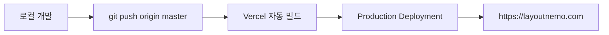

# 기술 스택 & 아키텍처

## 🧰 기술 스택

### Frontend
- **Next.js 16** (App Router)
- **React 19.2**
- **TypeScript 5**

### Styling
- **Tailwind CSS v4**
- **shadcn/ui** (Radix UI 기반 컴포넌트)
- **lucide-react** (아이콘)

### AI
- **OpenAI `gpt-4o-mini`** — 직접 호출 방식
  - Vercel AI Gateway는 결제 카드 요구 이슈로 미사용 (개발 중 전환)

### Storage
- **localStorage** — 기본 (로그인 없이 사용 가능)
- **Supabase** — 구글 로그인 시 동기화

### Auth
- **Supabase Auth + Google OAuth**

---

## 🚀 배포 & 도메인

### 초기 프로토타이핑
- **Vercel v0** — AI 기반 UI 생성으로 초기 UI/기능 구조 빠르게 프로토타이핑
- 이후 GitHub 이관 → VSCode에서 직접 구조 정제

### 운영 배포
- **플랫폼**: [Vercel](https://vercel.com)
- **방식**: GitHub 연동 자동 배포 (`git push` 기반 CI/CD)
- **레포**: [Yuwolx/LAYOUTNEMO](https://github.com/Yuwolx/LAYOUTNEMO)
- **Production Branch**: `master`

### 배포 흐름



### 도메인

- **서비스 주소**: [layoutnemo.com](https://layoutnemo.com) / [www.layoutnemo.com](https://www.layoutnemo.com)
- **Registrar**: Namecheap
- **HTTPS**: Vercel 자동 적용
- **네임서버**: Namecheap 기본 DNS 유지

**DNS 레코드**:

| Type | Host | Value |
|------|------|-------|
| A Record | `@` | `76.76.21.21` |
| CNAME | `www` | `cname.vercel-dns.com` |

### 왜 Vercel인가?

초기에는 EC2 기반 WAS 직접 배포도 검토했지만, 현재 단계에서 **인프라 구성에 리소스를 과투입하는 것은 적절하지 않다**고 판단했습니다. 한정된 시간 안에서 가장 중요한 것은 **서비스 철학의 구현과 검증**이었고, Vercel은 그 빠른 사이클을 지원하기에 충분했습니다.

### AWS 이전이 언제든 가능한 구조

현재 구조는 **도메인 이전성**을 전제로 설계되어 있습니다.

- 도메인은 Namecheap에서 **직접 소유**
- DNS는 Namecheap에서 관리 → 값만 바꾸면 **어느 인프라로든 옮겨갈 수 있음**
- 필요 시 Vercel → AWS EC2/ALB/CloudFront 로 전환 시 도메인은 그대로 사용 가능

단순 배포가 아닌, **"추후 확장과 반복 개선을 전제로 한 기준점"** 으로 도메인을 확보한 선택이었습니다.

---

## 🏛 아키텍처 개요

### 데이터 흐름 (블럭 생성 기준)

```mermaid
flowchart TD
    User[사용자 입력] --> Dialog[create-block-dialog]
    Dialog --> API[/api/ai/create-block]
    API --> OpenAI[OpenAI gpt-4o-mini]
    OpenAI --> Extract[제목/요약/기한/시급도 추출]
    Extract --> Page[page.tsx: handleCreateBlock]
    Page --> Place[findOptimalPosition - 스마트 배치]
    Place --> Storage[localStorage 저장]
    Storage --> Render[Canvas 렌더링]
```

### 저장 구조

- `layout_canvases` — 모든 캔버스 데이터
- `layout_current_canvas` — 현재 선택된 캔버스 ID
- **저장 타이밍**: CRUD 즉시 + 30초 주기 자동 저장
- **히스토리**: 최대 50개까지 Undo 가능

### 데이터 타입 (핵심만)

```ts
interface WorkBlock {
  id: string
  title: string
  description: string
  detailedNotes?: string
  x: number; y: number
  width: number; height: number
  zone: string                            // 내부 코드명. 블로그 표기는 "결(Facet)"
  urgency?: "stable" | "thinking" | "lingering" | "urgent"
  dueDate?: string
  relatedTo?: string[]
  isCompleted?: boolean
  isDeleted?: boolean
}
```

---

## 🔐 데이터 안전

- **로컬 우선** — 로그인 없이도 브라우저에 영구 저장
- **자동 저장** — 30초마다
- **히스토리 관리** — 최대 50단계 되돌리기
- **휴지통** — 삭제한 블럭은 10개까지 보관 (복원 가능)
- **내보내기** — JSON 전체 구조 또는 Markdown 문서 형식
