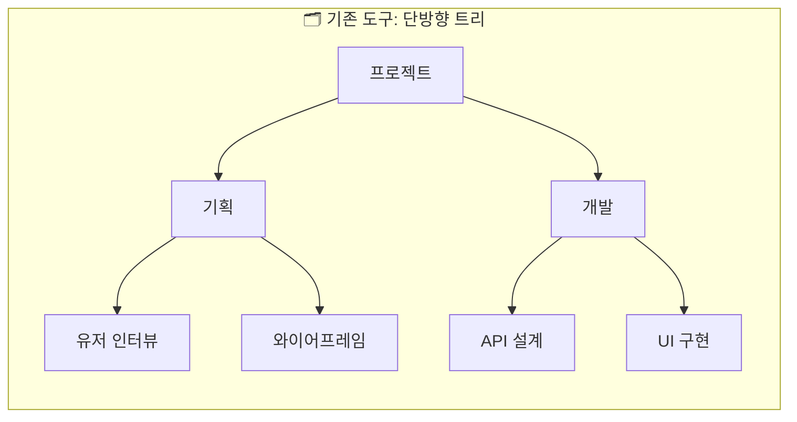
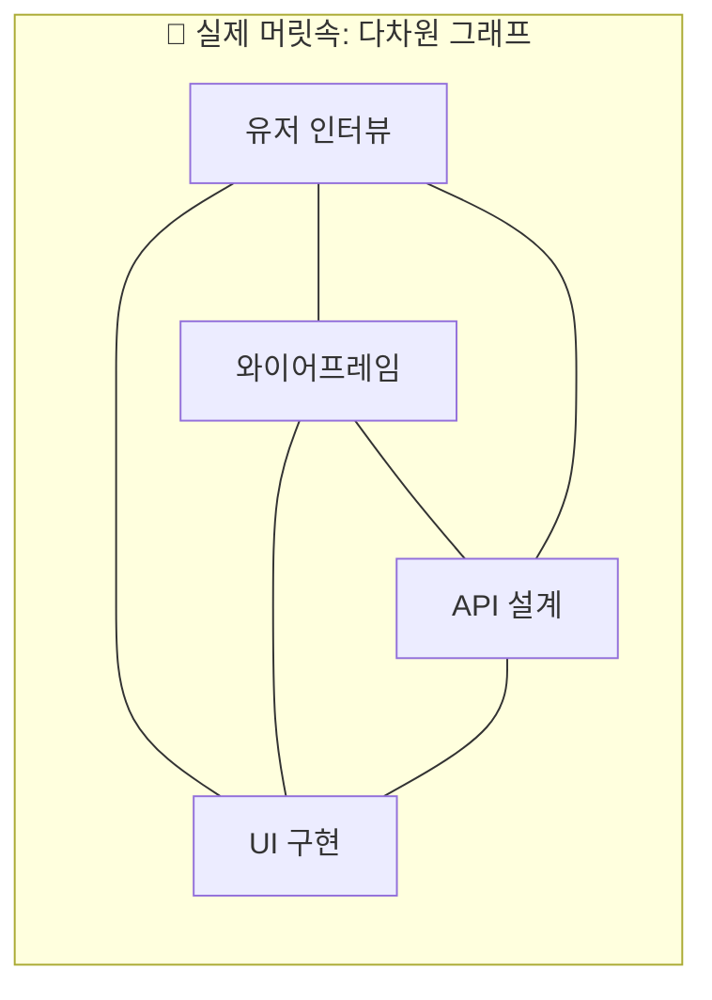

# 왜 만들었나

## 업무 관리가 아니라, 업무 사고의 문제

노션, 지라, 트렐로 같은 도구는 업무를 **테이블, 보드, 타임라인**의 형태로 정리해줍니다. 단정하고, 예측 가능하고, 관리하기 좋은 모양새죠.

그런데 저는 그런 도구를 쓸수록 더 답답해졌습니다. 이유는 단순했습니다 —
**그 구조 자체가 제 실제 사고 방식과 어긋나 있었기 때문입니다.**

## 머릿속은 단방향이 아니다

기존 도구들은 대개 업무를 **상위 → 하위**의 단방향 구조로 정리합니다.
하지만 실제로 머릿속에서 일어나는 일은 그렇지 않아요.

- 하나의 업무가 **여러 맥락에 걸쳐 있거나**
- 여러 개의 상위 개념에 **동시에 속해 있거나**
- 심지어 **순환 구조**를 이루기도 합니다

### 사고의 형태 비교

위는 "단정한 정리", 아래는 "실제 사고의 모양"입니다. 업무는 **선후보다 관계**에 가까워요.

## 그래서 내린 결론

> **업무가 정리되지 않는 이유는 개인의 정리 능력 문제가 아닙니다.**
> **업무를 담아낼 구조가 사고 방식과 맞지 않기 때문입니다.**

이 판단 위에서 LAYOUTNEMO를 기획했습니다.

사용자가 머릿속에서 업무를 인식하고 정리하는 형태를 **그대로 외부에 드러낼 수 있는 공간**.
정리되지 않은 상태 그대로 펼쳐놓을 수 있는 **캔버스**.

## AI의 역할 — 판단은 당신이, 마찰은 내가

업무를 등록하고 정리하는 행위는 매우 반복적입니다. 이 과정을 매번 사용자가 직접 수행한다면, 결국 기존 도구와 본질적으로 다르지 않아요.

그래서 AI를 붙였습니다. 단,

- AI는 **대신 판단하는 존재**가 아닙니다.
- AI는 **사용자의 사고 흐름이 단절되지 않도록 돕는 보조 장치**입니다.
- 마찰은 최소화하되, **판단은 사용자에게 남깁니다.**

그리고 **AI를 쓰지 않는 것도 하나의 선택지**가 되어야 한다고 생각했습니다. 그래서 AI는 언제든 끌 수 있습니다.

## 이름에 담긴 의도

**LAYOUTNEMO** = **LAYOUT** (펼쳐놓다) + **NEMO** (한국어 "네모"를 영어로 표기)

네모난 블럭을, 당신의 방식대로 펼쳐놓는 공간 — 이름 안에 이미 이 서비스의 본질이 담겨 있습니다.
